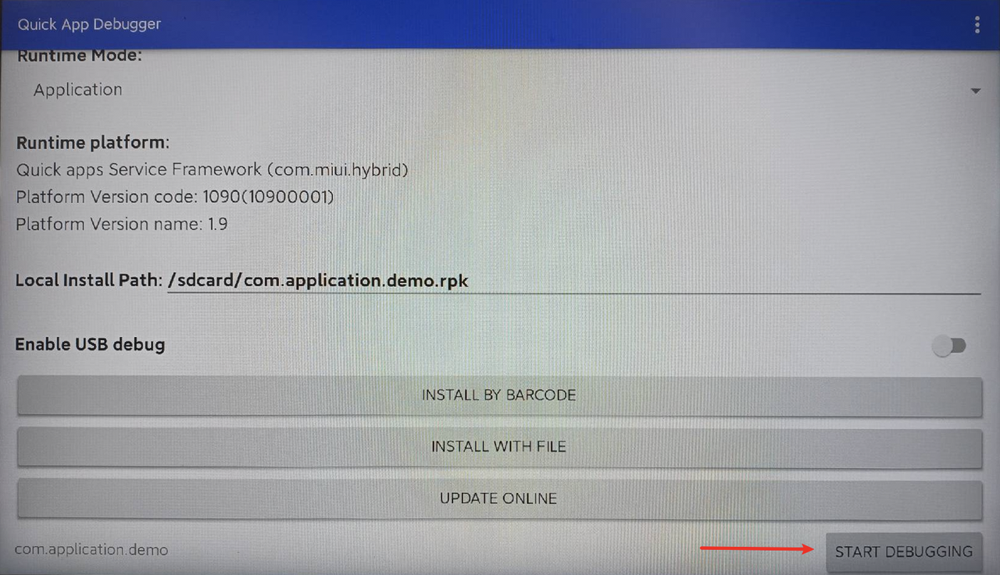

# Development and debugging

> Here we describe the development and debugging methods which will help you locate and solve problems.

Here's what you'll be able to do after reading:

- Use log output
- Debug remotely
- Debug browser rendering

## Using log output

**1. Change log level**

Open the manifest.json file in the "src" folder of the project's root directory. Locate the configuration ("config"), and modify "logLevel" to the lowest level of `debug`. This will allow all levels of log output.

Here's how the code in `<projectname>/src/manifest.json` will look like after you do this:

```
{
　"config": {
  　　"logLevel": "debug"
  }
}
```

**2. Generate logs in JS**

If the JS code doesn't run as required, generating logs can help developers quickly locate the problem. To be consistent with the traditional front-end development, use the `console` object to generate logs:

```
console.debug('debug')
console.log('log')
console.info('info')
console.warn('warn')
console.error('error')
```

**3. View logs**

Open the running platform. You'll see the `Show logs` button in the lower right corner. Tap it to view logs. You can also use the `Android Monitor` output of `Android Studio` to view logs.

## Run your app

With the Quick App Debugger turned on, enter the mina-app code directory on the computer and execute the command: npm runapp --watch. 

```shell
npm runapp --watch
```


Select or fill in the IP that needs to be deployed in the output content. Quick App Debugger will automatically open the page, if it fails, click UPDARE ONLINE in Quick App Debugger, and you can see the following interface:


## Remote debugging

Click the back button on the remote control to return to the home page of Quick App Debugger,Click START DEBUGGING in the lower right corner



The Chrome browser on your computer will automatically open the following page


You'll see the structure similar to the "src" folder. Each ux file here corresponds to an HTML file.

Click on the HTML file to debug it. You can preview the page rendered by the browser. The debugging method is the same as that for the regular web pages.