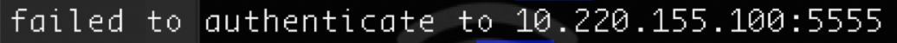

# Building environment

## Install Node.js

You need to install 8.0 or later versions of Node.js. Download it from the  [Node.js official website](https://nodejs.org/en/). 

## Install aiot-toolkit

```
npm install aiot-toolkit -g --force
aiot -v // If version name is returned, it indicates that aiot-toolkit is installed successfully.
```

## Connect the computer to the TV box

1. Make sure the computer and the TV box are connected to the same network.

2. Check the IP address of the box. System Settings → Network&Internet, see the Ip Address.


3. Ping the IP address of the TV box on the computer, for example, 10.220.155.100.


4. Connect to the TV box through adb.

```shell
adb connect 10.220.155.100 
```



If it's failed as shown in the image, try to:

a. Turn on the Developer mode of the TV. Go to Device preferences → Developer options → USB debugging, and set as "true".If there is no "Developer options", go to Device preferences → About → Build, and tap 5 times on the "Build" to turn on the Developer mode. 

b. Execute an adb connect 10.220.155.100 command again, and select "Yes" to allow connection. 

c. Execute an adb connect 10.220.155.100 command again.

If they are connected successfully, the output as shown in the image will display, then you can continue the subsequent operations.


## Install the development and debugging environment

Execute an adb devices command after the computer is connected to the TV box.


You can view the TV box connected. If not, make sure the computer is connected to the TV box first. Install the runtime environment and debugger on the box:

```shell
adb install -r -t -d  quickapp-tv-1900.apk
adb install -r -t -d  quickapp-tv-debugger.apk
```

You can get `quickapp-tv-1900.apk` from [download](), and `quickapp-tv-debugger.apk` from [download]().

After the installation, go to Settings → Apps → See all apps → Show system apps → Quick App Debugger, and turn on the debugger as shown below:


The debugger is now installed.

