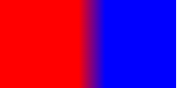

# Gradient style `101+`

Gradients can display a smooth transition between 2 or more specified colors, they are used in the same way as CSS gradients.

The current framework supports the following gradient effects:

- Linear gradients
- Repeating linear gradients

## Linear gradients/Repeating linear gradients

To create a linear gradient, you need to define 2 types of data: 1) transition direction, and 2) transition color. Therefore, you need to define at least 2 colors.

1. Transition direction can be specified by `direction` or `angle`.
2. Transition color supports the following 3 ways: `red`, ``#FF0000`, `rgb(255, 0, 0)`, `rgba(255, 0, 0, 1)`.

- Direction: gradient direction

```
background: linear-gradient(direction, color-stop1, color-stop2, ...);
background: repeating-linear-gradient(direction, color-stop1, color-stop2, ...);
```

- Angle: gradient angle

```
background: linear-gradient(angle, color-stop1, color-stop2);
background: repeating-linear-gradient(angle, color-stop1, color-stop2);
```

### Parameters

| Name       | Type                                     | Default value                        | Required | Description                              |
| ---------- | ---------------------------------------- | ------------------------------------ | -------- | ---------------------------------------- |
| direction  | `to` `<side-or-corner>` `<side-or-corner>` = [`left` &#124; `right`] &#124;&#124; [`top` &#124; `bottom`] | `to bottom` (top to bottom gradient) | No       | Example: `to right` (left-to-right gradient) Example: `to bottom right` (top left to bottom right-hand corner) |
| angle      | `<deg>`                                  |                                      | No       | Coordinates are established at the center of the graph as the origin of the x-axis, the gradient line is the with the y-axis (clockwise). |
| color-stop | `<color>` [`<length>`&#124;`<percentage>`]    |                                      | Yes      | Display the background color from the start point to the `stop` area as `color` |

### Example:

```
#gradient {
  height: 100px;
  width: 200px;
}
```

```
/* Start gradient from the top. The starting point is red and slowly transitions to blue */
background: linear-gradient(red, blue);
```


```
/* 45° angle, gradually transition from red to blue */
background: linear-gradient(45deg, rgb(255,0,0),rgb(0, 0, 255));
```


```
/* Left-to-right gradient, form a gradient with a width of 30px between a distance of 90px from the left and 120px (200*0.6) from the right*/
background: linear-gradient(to right, rgb(255,0,0) 90px, rgb(0, 0, 255) 60%);
```



```
/* Left-to-right gradient, repeating linear gradient area of 10px (20-10) and transparency of 0.5 */
background: repeating-linear-gradient(to right, rgba(255, 0, 0, .5) 10px,rgba(0, 0, 255, .5) 20px);
```


